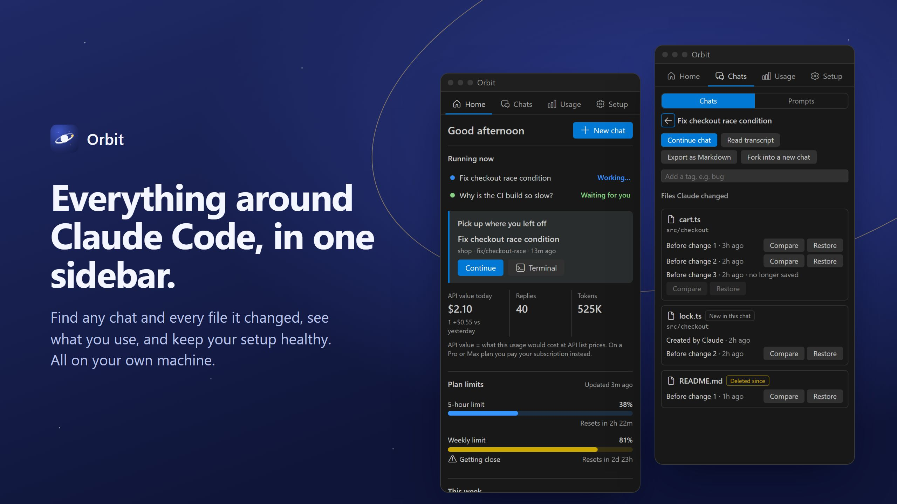
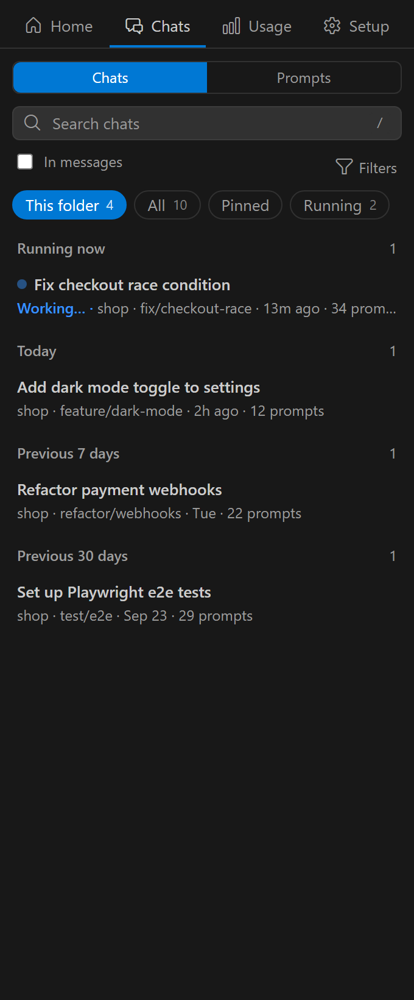
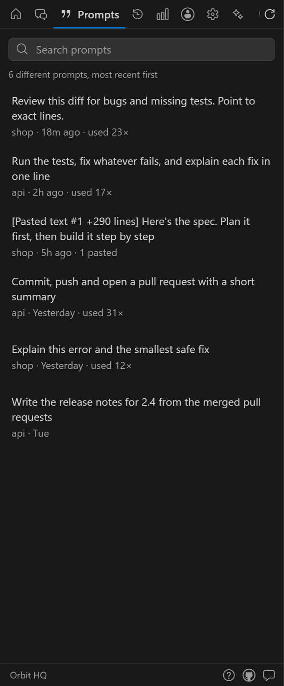
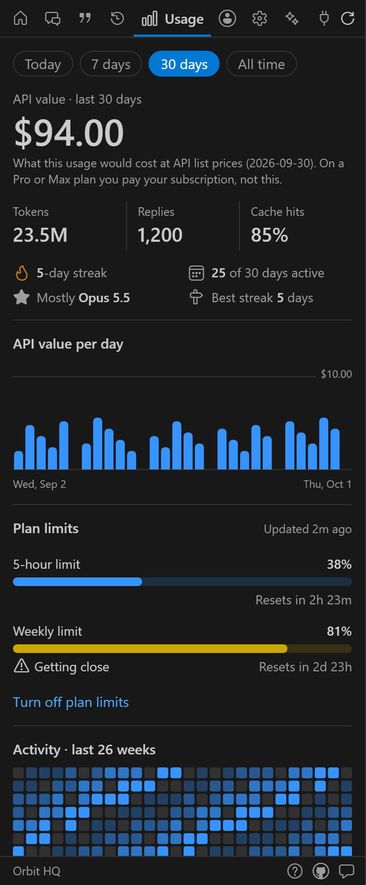
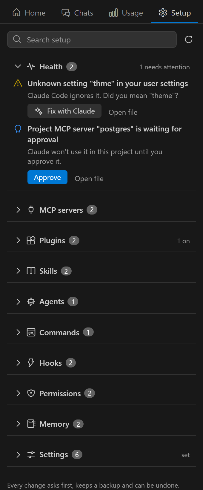

  

# Orbit HQ

**Your home for Claude Code.** Every chat, your usage and your whole setup, in one calm sidebar.
100% local: no account, no network, no telemetry.

Orbit is a companion. You still talk to Claude in Claude Code's own chat or terminal; Orbit finds,
explains and tidies everything around it, then hands you back to Claude.

  
  
  
  

Chats, Prompts, Usage and Setup. Orbit follows your VS Code theme, light or dark.

## What you get

| Tab | |
|---|---|
| **Home** | Today at a glance: continue your last chat, what's running, today's usage, plan limits, setup warnings. |
| **Chats** | Every chat from the terminal and the extension. Search titles or **inside messages**, filter by folder, branch and date, pin, rename, tag. Continue in Claude's chat or a terminal, or **fork** into a new chat (needs the `claude` command). Open a chat's **files and transcript**: every file Claude changed, each version, compare with now, safe restore, readable transcript, export to Markdown. **Prompts**: every prompt you've typed (repeats collapsed, pasted text restored), ready to use again. |
| **Usage** | Tokens and cost by day, week and month, by model and project, a 6-month activity map, and a weekly recap card to share (image or Markdown). Optional 5-hour and 7-day **plan limits**. |
| **Setup** | MCP servers, plugins, skills, agents, commands, hooks, permissions, memory and CLAUDE.md files, and Claude's settings. See them and change them safely. A **health check** finds broken JSON, missing commands, servers waiting for approval and more, and **Fix with Claude** opens a chat with the fix typed in. |

## Safe by design

- **Claude keeps working exactly as before.** Orbit never deletes chats and never rewrites Claude's own
  history or transcripts. It never touches login tokens.
- **Every change asks first.** You see the exact change, Orbit keeps a backup, and one click undoes it.
  If Claude changes a settings file while you're deciding, Orbit applies just your change on top of
  Claude's; for a whole file (like restoring an old version) it asks you again instead of overwriting.
- **Only Claude's official settings**, straight from its published settings schema.
- **Nothing is typed into a shell.** Chats open through Claude Code's documented link, or by starting
  `claude` directly.
- **Secrets stay hidden in Orbit's views.** API keys and tokens in env values, server arguments, URLs,
  hooks, permission rules and transcript tool lines are masked. (VS Code's own diff of a change shows the
  real file, and chat text is shown as it was written.)
- Orbit's own data (pins, tags, backups) lives in VS Code's storage, never in `~/.claude`.

## Good to know

- **Costs are "API value"**: what the tokens would cost at Anthropic's API prices. On a Pro or Max plan
  you pay your subscription instead; the numbers show how much you use.
- **Plan limits are opt-in.** Turning them on adds a tiny helper to Claude Code's status line that saves
  the limits Claude already reports. Your own status line keeps working, and uninstalling Orbit puts
  your setting back.
- Respects `CLAUDE_CONFIG_DIR`. Works on Windows, macOS and Linux, in VS Code and editors built on it.

## Keyboard

`Ctrl+Alt+O` (`Cmd+Alt+O` on Mac) opens Orbit. In Chats: `/` search · `↑` `↓` move · `Enter` continue ·
`Shift+Enter` terminal · `Alt+D` files and transcript · `Alt+P` pin · `Alt+C` copy resume command ·
`F2` rename. Search `#tag` to find tagged chats.

## Requirements

VS Code 1.94 or later, and Claude Code: the Claude Code extension, the `claude` command, or both.
