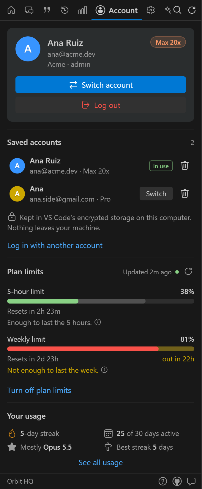
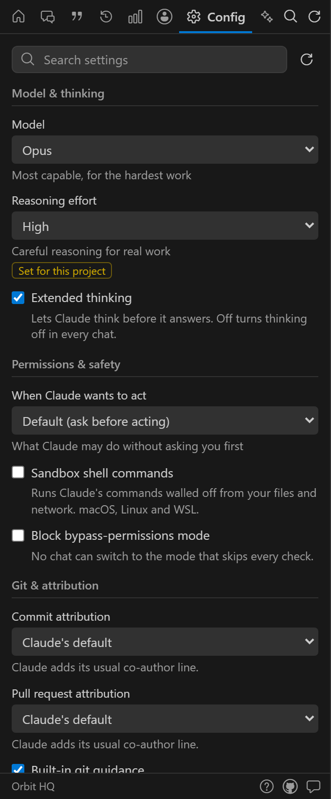
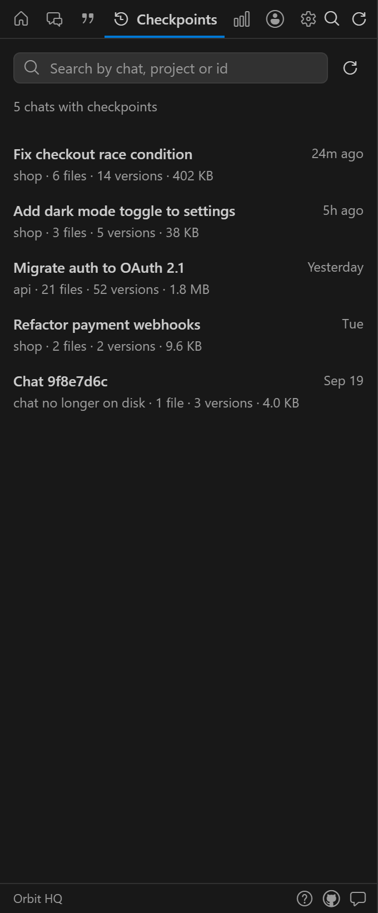

  

# Orbit HQ

**[Install from the VS Code Marketplace](https://marketplace.visualstudio.com/items?itemName=OmSharma.orbit-hq)**, or search
"Orbit HQ" in VS Code's Extensions view.

**Your home for Claude Code.** Every chat, your accounts, your usage and your whole setup, in one
calm sidebar. 100% local: no sign-up, no network, no telemetry.

Type what Claude should do on Home and Orbit starts Claude for you, in a terminal or Claude's own chat
panel (your choice). Orbit finds, explains and tidies everything around Claude, then hands you back.

  
  
  
  

Chats, Account, Config and Checkpoints. Orbit follows your VS Code theme, light or dark.

## What you get

Fourteen tabs along the top; hover near either end of the bar to glide through them, reorder or hide
them in Config, or press **Ctrl+K** (**Cmd+K**) to search everything at once. A welcome screen shows
them all the first time (and from the **?** at the bottom).

| Tab | |
|---|---|
| **Home** | Type what Claude should do, continue your last chat, what's running, today's usage, a Get started checklist. |
| **Chats** | Every chat with live status (green while Claude works, orange when it waits for you), folder, branch and worktree. Grouped by day, filter by project, branch, worktree and date, search titles or **inside messages**. Open a chat to see its stats and read it (latest or earliest first, searchable), continue it in a terminal (Orbit offers to switch branch first), fork, rename, pin, archive, hide, export or import chats, temporary chats. |
| **Prompts** | Every prompt you've typed (repeats collapsed, pasted text restored), by project; click one to open its chat. |
| **Checkpoints** | Chats → files → versions: compare any version with the file now, restore it (backed up, undoable), open the file. Finds versions the chat no longer mentions. |
| **Usage** | Tokens, chats, replies and cache by period, cost by model, projects, tools and MCP servers, a year of activity, your longest chat, and a recap card to share. |
| **Account** | Who's signed in and your plan, **switch accounts in one click**, log in or out, and **plan limits** with a pace verdict ("enough to last the week?"), also in the status bar, turning yellow and red as you near a limit. |
| **Config** | Model, effort, thinking, permissions, sandbox, git attribution, voice and more in plain words, one click each. Health check, permission rules with common presets, extra folders, every Claude setting, **Undo history**, sidebar tabs, and **brain backup** to move your setup to another computer. |
| **Skills · MCP · Plugins · Agents · Commands · Hooks · Memory** | Each part of your setup in its own tab, every item with a page of its own: use skills and commands in a chat, edit agents fully, pause or edit single hooks, check and sign in to MCP servers, see which settings file turns a plugin on, follow links between memories. All 100+ of Claude Code's built-in commands are listed too. |

## Safe by design

- **Claude keeps working exactly as before.** Orbit never deletes chats and never rewrites Claude's own
  history or transcripts.
- **Your sign-in stays yours.** Orbit only handles Claude's login when you save or switch an account:
  the saved copy goes into VS Code's encrypted secret storage, switching asks first and backs up
  `~/.claude.json`, and tokens never reach Orbit's views. Logging in and out uses Claude's own
  `claude auth` commands.
- **Every change asks first.** You see the exact change, Orbit keeps a backup, and one click undoes it.
  Config's **Undo history** lists every change Orbit made.
- **Deleting never deletes.** A deleted skill, agent, command or memory moves to Orbit's trash; Undo or
  the Undo history puts it back. Pausing a hook keeps it in Orbit's storage, never as a key Claude
  doesn't know.
  If Claude changes a settings file while you're deciding, Orbit applies just your change on top of
  Claude's; for a whole file (like restoring an old version) it asks you again instead of overwriting.
- **Only Claude's official settings**, straight from its published settings schema. Quick settings in
  Config apply in one click and can be undone; anything that turns off a safety check still asks.
- **Nothing is typed into a shell.** Chats start `claude` directly as the terminal's program (or open
  Claude Code's documented link), and a prompt is only passed along when it's safe to.
- **Secrets stay hidden in Orbit's views.** API keys and tokens in env values, server arguments, URLs,
  hooks, permission rules and transcript tool lines are masked. (VS Code's own diff of a change shows the
  real file, and chat text is shown as it was written.)
- **Brain backups leave secrets out**: settings' `env` and MCP keys and headers are never exported, and
  importing backs up everything it replaces, with one Undo.
- Orbit's own data (pins, tags, backups, trash) lives in VS Code's storage, never in `~/.claude`.

## Good to know

- **Costs are "API value"**: what the tokens would cost at Anthropic's API prices. On a Pro or Max plan
  you pay your subscription instead; the numbers show how much you use.
- **Plan limits are opt-in.** Turning them on adds a tiny helper to Claude Code's status line that saves
  the limits Claude already reports. Your own status line keeps working, and uninstalling Orbit puts
  your setting back.
- Respects `CLAUDE_CONFIG_DIR`. Works on Windows, macOS and Linux, in VS Code and editors built on it.

## Keyboard

`Ctrl+Alt+O` (`Cmd+Alt+O` on Mac) opens Orbit, `Ctrl+K` searches everything, `Ctrl+Alt+R` refreshes.
`←` `→` `Home` `End` move between tabs. In Chats: `/` search · `↑` `↓` move · `Enter` continue ·
`Shift+Enter` terminal · `Alt+D` files and transcript · `Alt+P` pin · `Alt+C` copy resume command ·
`F2` rename. Search `#tag` to find tagged chats.

## Settings

- `orbit.openChatsIn`: `terminal` (default, Claude Code's CLI, works for chats from any folder) or
  `claudePanel` (Claude's VS Code chat panel).
- `orbit.terminalLocation`: `editor` (default, a tab beside your code) or `panel`.
- `orbit.editorPosition`, `orbit.chats.defaultFilter`, `orbit.chats.defaultProject`,
  `orbit.chats.restoreCount`, `orbit.terminal.keepSessionNames`, `orbit.tabOrder`,
  `orbit.hiddenTabs`, `orbit.density`.

All are also on the Config tab. Commands: **Orbit: Switch Claude account**, **Orbit: Get started**,
**Orbit: Back up your Claude setup**, **Bring in a Claude setup backup**, **Check Claude Code's
health**, **Report a problem**, and **Orbit: Show …** for each main tab.

## Requirements

VS Code 1.94 or later, and Claude Code: the Claude Code extension, the `claude` command, or both.
